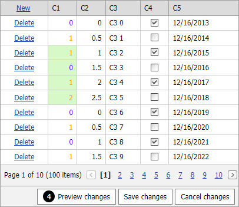

<!-- default badges list -->

[](https://supportcenter.devexpress.com/ticket/details/T466715)
[](https://docs.devexpress.com/GeneralInformation/403183)
<!-- default badges end -->
# Grid View for ASP.NET Web Forms - How to modify cell styles dynamically in Batch Edit mode

This example demonstrates how to apply conditional cell formatting dynamically in Batch Edit mode.



In Batch Edit mode, modified cell values are stored on the client side until you press the "Save Changes" button. This causes the conditional formatting specified in the [HtmlDataCellPrepared](https://docs.devexpress.com/AspNet/DevExpress.Web.ASPxGridView.HtmlDataCellPrepared) event handler is not applied to the modified cells. To format modified cells in Batch Edit mode, set element styles dynamically in the client [BatchEditEndEditing](https://docs.devexpress.com/AspNet/js-ASPxClientGridView.BatchEditEndEditing) event handler.

Handle the [HtmlDataCellPrepared](https://docs.devexpress.com/AspNet/DevExpress.Web.ASPxGridView.HtmlDataCellPrepared) event and add a custom attribute for each data cell of the formatted column.


```csharp
protected void Grid_HtmlDataCellPrepared(object sender, DevExpress.Web.ASPxGridViewTableDataCellEventArgs e) {
    if (e.DataColumn.FieldName != "C1") return;
    e.Cell.Attributes.Add("fieldName", e.DataColumn.FieldName);
    // ...
}
```

Specify the [Styles.Row.CssClass](https://docs.microsoft.com/en-us/dotnet/api/system.web.ui.webcontrols.style.cssclass?view=netframework-4.8.1#System_Web_UI_WebControls_Style_CssClass) property and use this class and attribute to access the edited cell on the client side. 

```aspx
<dx:ASPxGridView ID="Grid" runat="server" KeyFieldName="ID" ...>
    <Styles>
        <Row CssClass="row"></Row>
    </Styles>
    @* ... *@
```

Set the modified cell's style in the client-side [BatchEditEndEditing](https://docs.devexpress.com/AspNet/js-ASPxClientGridView.BatchEditEndEditing) event handler based on the newly entered value.

```js
function OnBatchEditEndEditing(s, e) {
    var colorColumn = s.GetColumnByField("C1");
    var c1 = e.rowValues[colorColumn.index].value;
    window.setTimeout(function () {
        if (c1 > 0)
            ChangeCellColor("Orange", e.visibleIndex, "C1");
        else
            ChangeCellColor("Blue", e.visibleIndex, "C1");
    }, 50);
}

function ChangeCellColor(color, index, colName) {
    var col = $(".row[id$=" + index + "] td[fieldName=" + colName + "]");
    if (color == "Orange") {
        col.addClass("orangeCell");
        col.removeClass("blueCell");
    }
    else {
        col.addClass("blueCell");
        col.removeClass("orangeCell");
    }
}
```
